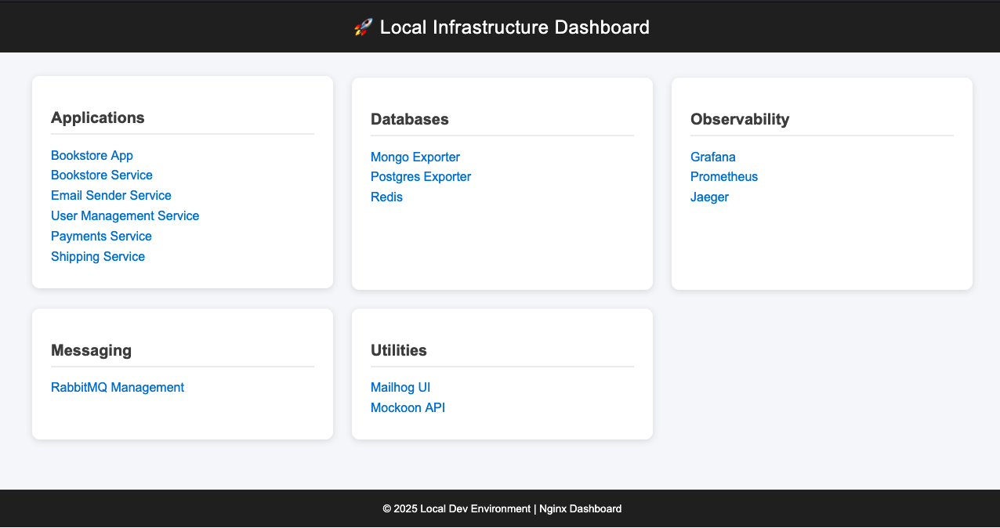
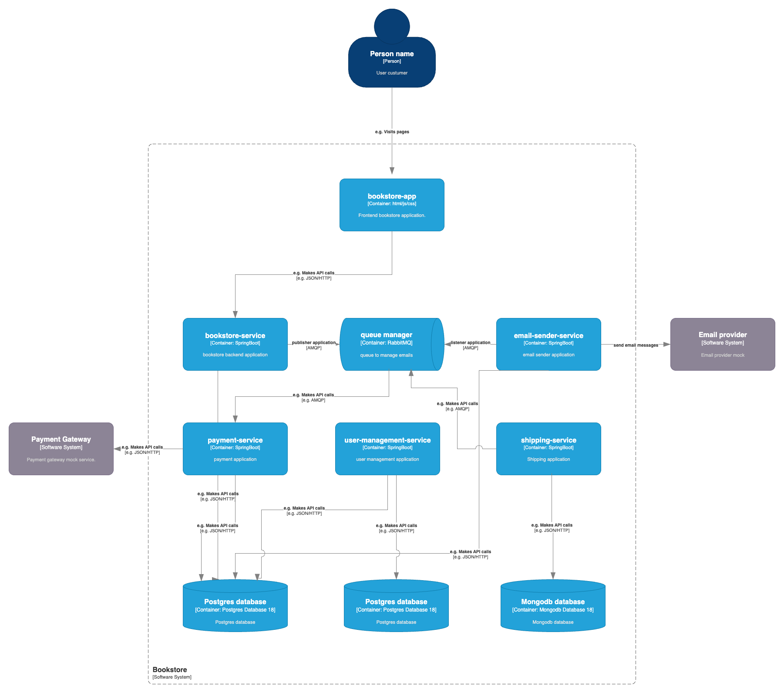
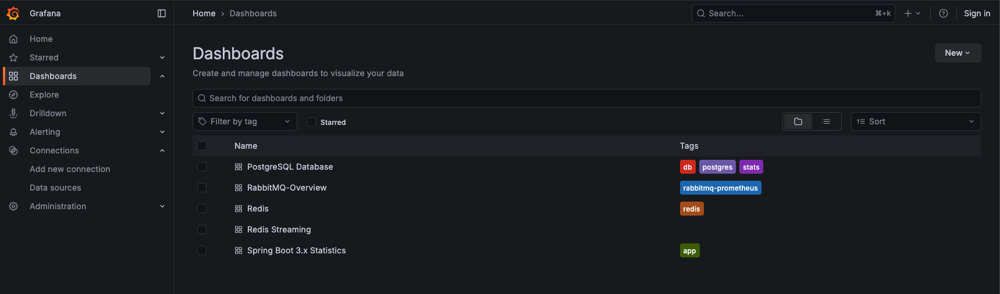
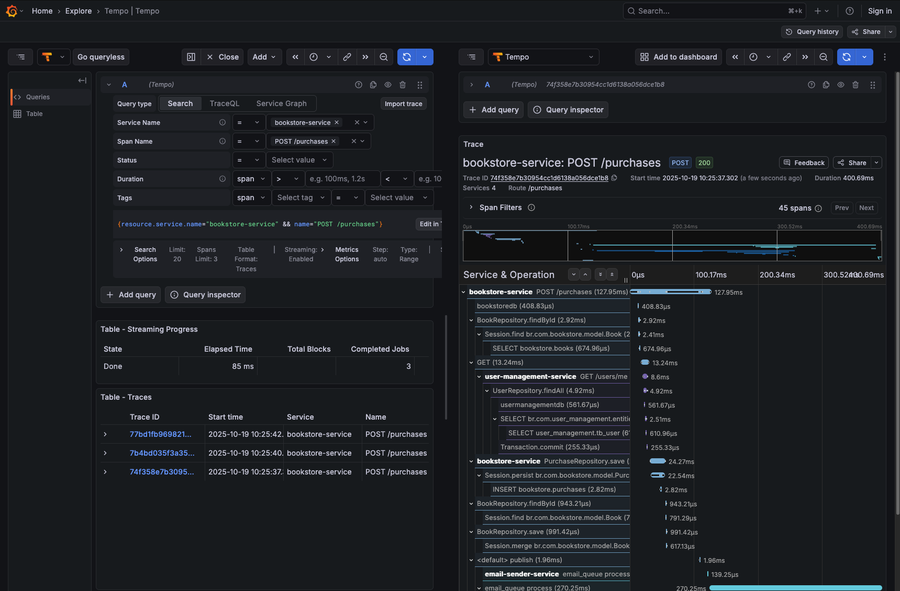
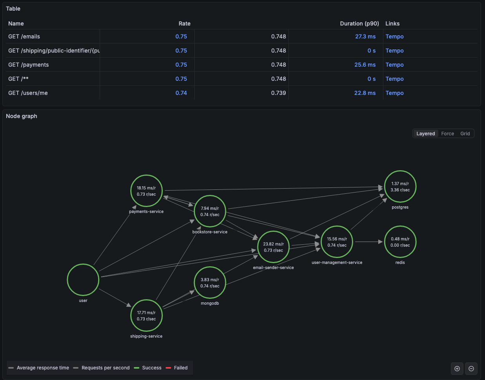
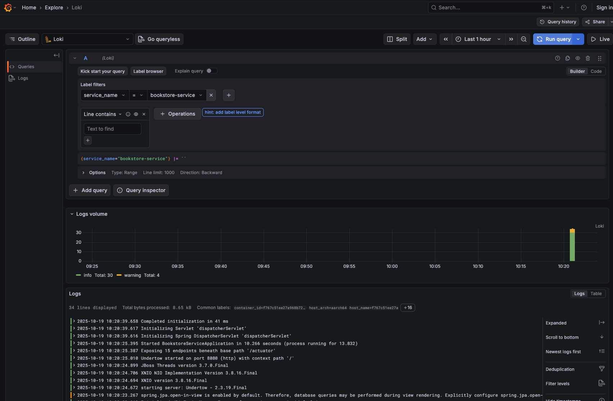
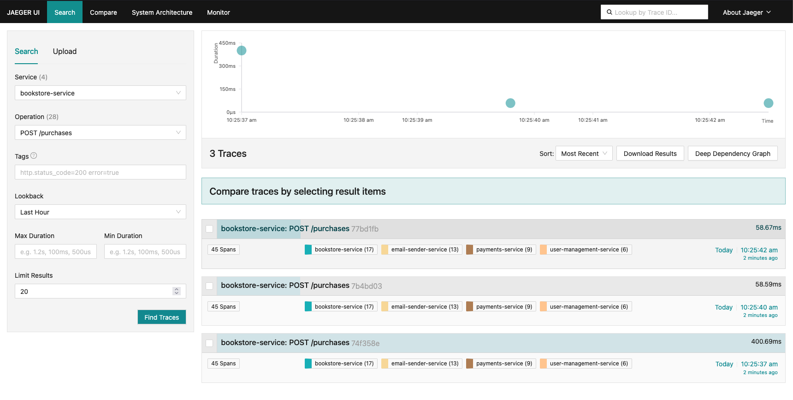
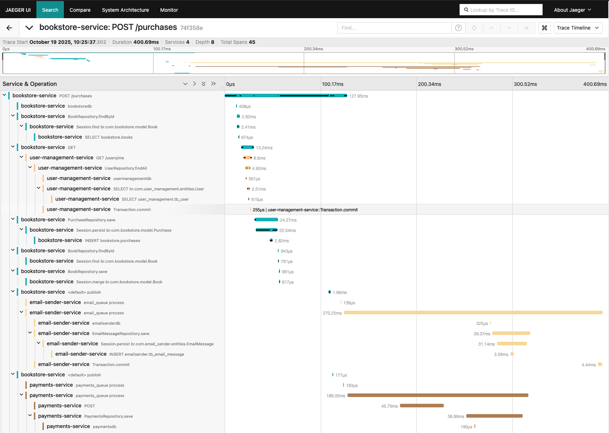
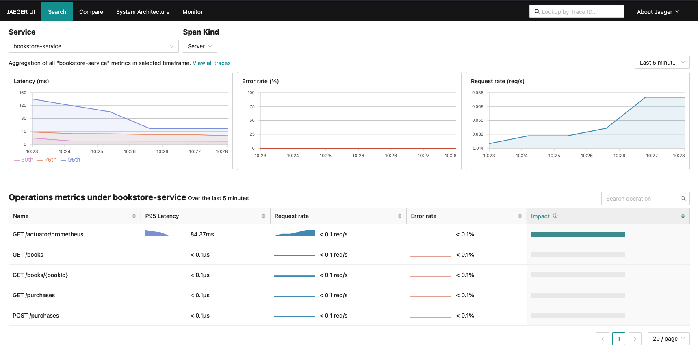

## 🧪 Microservices & Observability Lab

This project is a sandbox environment created to study, experiment, and demonstrate modern observability practices within a microservices architecture.
It brings together multiple Spring Boot–based microservices and a complete observability stack — including Grafana, Prometheus, Tempo, Loki, and Jaeger — to simulate a realistic production ecosystem.
The environment is fully containerized with Docker Compose, and each microservice is instrumented using OpenTelemetry (OTEL) agents and Prometheus for collecting and exporting traces, metrics, and logs.

## 🎯 Goals

This lab serves as a foundation for exploring:
	•	Microservices communication patterns (REST, messaging with RabbitMQ, etc.)
	•	Distributed tracing and metrics correlation
	•	Resilience, monitoring, and alerting
	•	Software architecture approaches

## 🚀 Overview

In short, this project provides a **hands-on learning platform** to explore how observability integrates with real-world microservice systems. It is **not a production-ready solution**; instead, it serves as a **base project** that can be used to study and experiment with topics relevant to environments similar to those found in a professional setting.

### Project Structure

```
root
├── applications
│   ├── Frontend
│       ├── Bookstore app        # site for bookstore
│       └── Dashboard app        # site with all links to applications configured in this docker-compose file.
│   ├── Backends
│       ├── bookstore            # Spring Boot application for bookstore api
│       ├── email-sender         # Spring Boot application for sending emails
│       ├── payments             # Spring Boot application for managing payments
│       ├── shipping             # Spring Boot application for managing shippings
│       └── user-management      # Spring Boot application for user management
└── infrastructure
├── postgresql           # PostgreSQL 18 database
├── mongodb              # mongodb database
├── Redis                # Redis database
├── Rabbitmq             # RabbitMQ message broker
├── Mailhog              # Mail testing tool
├── Mockoon              # Fake api to mock request
├── Grafana              # Grafana dashboards and configuration
│   ├── Loki             # Grafana Loki for log aggregator
│   └── Tempo            # Grafana Tempo for tracings
├── Prometheus           # Prometheus monitoring server
├── Jaeger               # Jaeger distributed tracing
└── Otel-Collector       # OpenTelemetry collector
```

## Pre-requisites

Before running the project, make sure you have installed:

- **Java 21** (required only to execute applications in IDE)  
- **Docker** (to run applications and infrastructure services)


## Running the Project

All applications and infrastructure services are designed to run using Docker Compose. Inside ***infrastructure*** folder execute to build the Java applications and start all application using docker-compose:

```bash
sh start.up build
```

The build attribute is necessary to build the microservices applications. After the images were built execute:

```bash
sh start.up
```

To stop all applications execute the following script:
```bash
sh stop.sh
```

## Generating metrics

After start the environment with ***docker-compose up*** or the ***start.sh*** you can run a k6 script to start to fill the metrics in the applications. This proccess take some minutes. The configurations to k6 are in ***docker-compose-test.yaml*** file. To run k6 execute the following command inside ***infrastructure*** folder.

```bash
docker-compose -f docker-compose-test.yaml up
```

## Accessing the Applications

Once the containers are running, you can access the services and monitoring tools throught the Dashboard application: http://localhost/dashboard.



### Project diagram



---

## Visualizing the metrics in Grafana and Jaeger

### Logs, metrics and trances in Grafana.

All dashboards imported in Grafana are from the https://grafana.com/grafana/dashboards/ site. 



### Grafana Tempo




### Grafana Loki



## Jaeger 



